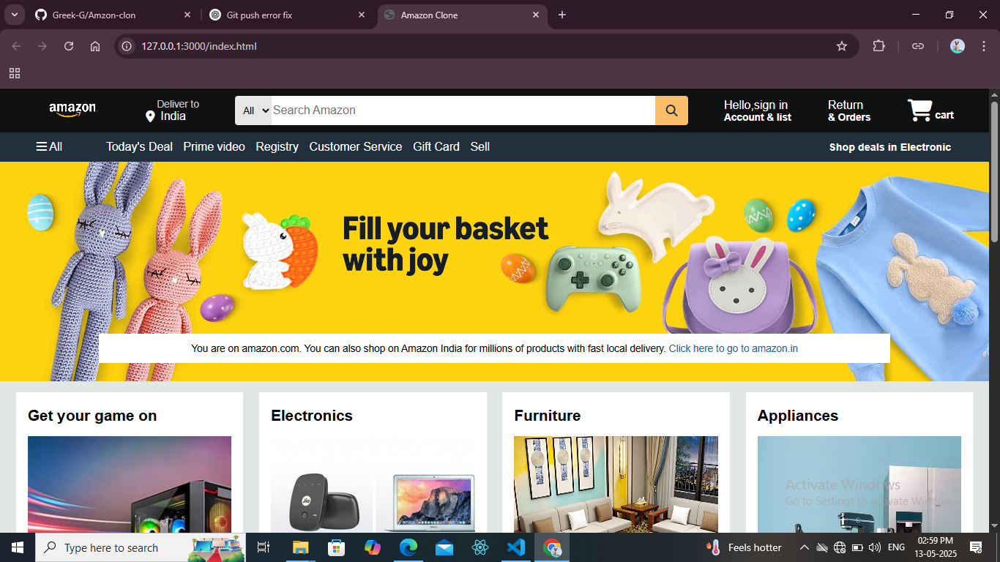

# 🛒 Amazon Clone

A front-end clone of the Amazon homepage built using **HTML** and **CSS**, mimicking the layout and basic structure of the official Amazon.com website.

## 🚀 Features

- Responsive header with logo, address, search bar, and user options
- Navigation panel with quick access links
- Hero section with promotional banner
- Product section showcasing categories with images and titles
- Footer with multi-column links, branding, and copyright

## 📁 Project Structure
amazon-clone/
│
├── index.html
├── style.css
├── box1-img.jpg
├── box2-img.jpg
├── box3-img.jpg
├── box4-img.avif
├── box5-img.avif
├── box6-img.jpg
├── box7-img.jpg
├── box8-img.webp
├── hero-image.jpg
├── preview.png
├── 1amazon-dark-logo-png-transparent-removebg-preview.png
└── README.md
